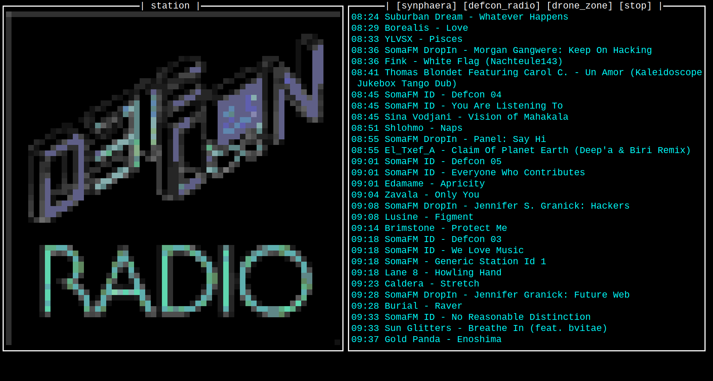

# somakey

somakey allows switching between several preset stations on SomaFM with minimal fuss.  somakey uses the code here, plus the hardware components listed below. 

It is like a purpose built ~1980s car radio inspired macro pad.  When the hardware is connected via USB, each keypress sends a function key (F16-F19).  The text UI (somakey.py) runs in a terminal window to control the media player, display current and past tracks and display the station's graphics with intentionally low resolution.

Each key press switches between three preset SomaFM stations with the fourth key to stop the music.  Each key is lit in a color resembling the station's graphics.

somakey was designed specifically to run on a dedicated secondary computer in order to enable continously playing music even when a primary computer is rebooted, shutdown, etc.

# Requirements
## Operating System
- Linux running X or macOS

## Hardware
- NeoKey 1x4 QT I2C - https://www.adafruit.com/product/4980
- QT Py RP2040 - https://www.adafruit.com/product/4900
- 3d printed enclosure (optional)

# Installation
1. Connect QT Py via USB
1. Install Circuit Python on the QT Py - https://learn.adafruit.com/welcome-to-circuitpython/installing-circuitpython
1. Download Adafruit Circuit Python bundle - https://github.com/adafruit/Adafruit_CircuitPython_Bundle/releases/latest
1. Copy the following libraries from the Circuit Python bundle to the lib/ directory on the QT Py that now has Circuit Python: adafruit_hid, adafruit_neokey, adafruit_neopxl8.mpy, neopixel.mpy
1. Copy the following to the root directory on the QT Py: code.py, somakey.py, stream_data.py, img/
1. Install required dependencies (pip3 install prompt_toolkit)

## Usage
1. In suitably sized terminal window, cd into the Circuit Python dir on the QT Py and run somakey.py

# Screenshot

